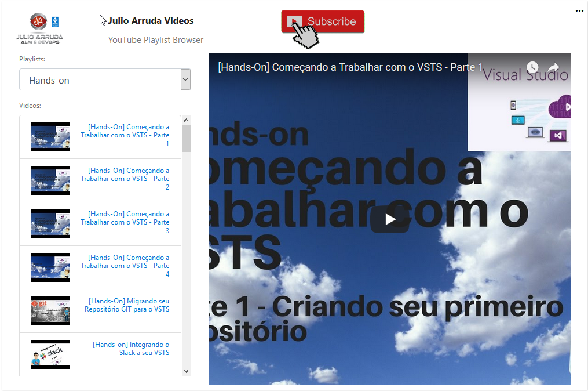
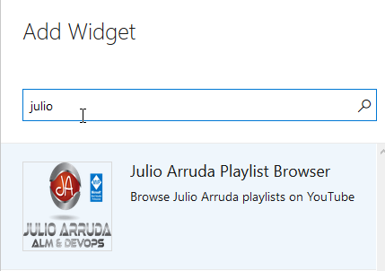

## Tutorial

The **Julio Arruda Widgets** shows all videos of Julio Arruda Channel within VSTS on your dashboards.

Build And Publish

## Quick steps to get started ###

1. Create new Dashboard (suggested name "Video Features")

2. Edit your dashboard.

3. Select the **Julio Arruda Playlist Browser** and click Add.
 

 
## Repo Original
This repo was forked from VSTS Sprints (vinijmoura/YoutubeWidget)
 
## Contributors
We thank the following contributor(s) for this extension: Gustavo Bergamin.

##Contribute
Contributions to Julio Arruda Widget are welcome. Please fork this repo.

- Submit bugs and help us verify fixes.
- Submit pull requests for bug fixes and features and discuss existing proposals.
